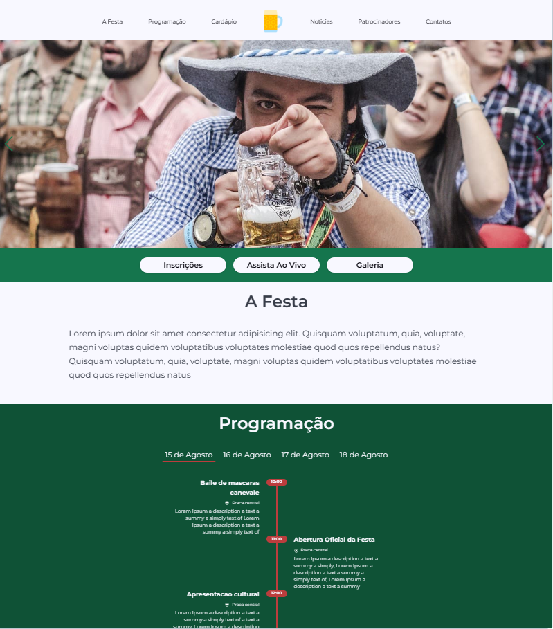

# Portifolio LP festival

<h2  align="center">

</h2>


<p  align="center">
<a  href="#-projeto">Projeto</a>&nbsp;&nbsp;&nbsp;|&nbsp;&nbsp;&nbsp;
<a  href="#-tecnologias">Tecnologias</a>&nbsp;&nbsp;&nbsp;|&nbsp;&nbsp;&nbsp;
<a  href="#-scripts">Scripts</a>&nbsp;&nbsp;&nbsp;|&nbsp;&nbsp;&nbsp;
<a  href="#-licença">Licença</a>
</p>


## 💻 Projeto
  

Este projeto é uma aplicação ReactJS, typescript e css modules, criacao de uma LP (landing Page) de um festival, o objetivo e ter informações do evento como programação e informações gerais, trabalhando com sessões das mesmas e ancoragem para os links.


## 🧪 Tecnologias

O projeto foi desenvolvido usando as seguintes tecnologias:


<!--  -->


[](https://reactjs.org)
[](https://vitejs.dev)
[](https://www.typescriptlang.org)
[](https://developer.mozilla.org/pt-BR/docs/Web/CSS)
[](https://tailwindcss.com)
[](https://michalsnik.github.io/aos)


## 📝 Scripts
Instale as dependências.

```bash

$ yarn

```

  
Para executar o projeto rode o comando abaixo.

```bash

$ yarn dev

```
  
Para criar o build de produção.

```bash

$ yarn build

```


## 📝 Licença 
 

This project is licensed under the MIT License. See the [LICENSE](LICENSE.md) file for details.

  ---


<p  align="center">Made with 💚 by <a  href="https://github.com/hog099"  target="_blank">Hudson Oliveira Ginelli</a></p>